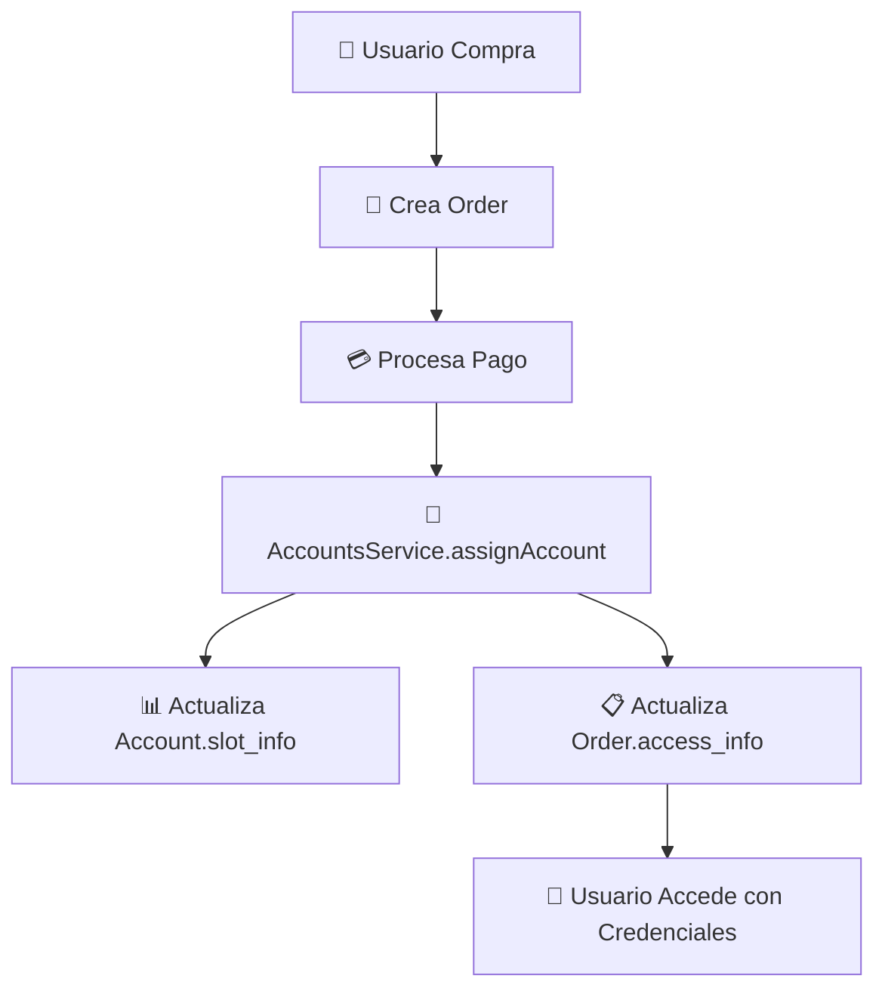

# ✅ MIGRACIÓN COMPLETADA - UserOrder → Order

## 🎯 **OBJETIVOS LOGRADOS**

### ✅ **1. Eliminación de Redundancia**
- **ANTES:** 2 schemas separados (`Order` + `UserOrder`)
- **DESPUÉS:** 1 schema unificado (`Order`)

### ✅ **2. Consolidación de Funcionalidades**
- **Información de órdenes** ← Order original
- **Información de acceso** ← UserOrder fusionado
- **Estados unificados** ← Enum consolidado

### ✅ **3. Servicios Actualizados**
- `AccountsService` → Usa Order unificado
- `OrdersService` → Métodos para acceso agregados
- `ServicesModule` → Imports actualizados

## 📊 **ARQUITECTURA FINAL**

```typescript
Order {
  // INFORMACIÓN BÁSICA
  customer: ObjectId,           // ✅ Cliente
  user_id: string,             // ✅ ID del usuario
  out_trade_no: string,        // ✅ Número único de orden
  
  // SERVICIO
  service_name: string,        // ✅ "Netflix", "Spotify"
  plan_name: string,          // ✅ "6 meses Personal"
  duration_months: number,    // ✅ Duración
  max_users: number,          // ✅ Máximo usuarios
  
  // ESTADOS Y FECHAS
  order_status: OrderStatus,  // ✅ 'pending' | 'active' | 'expired'
  starts_at: Date,           // ✅ Inicio
  expires_at: Date,          // ✅ Vencimiento
  
  // ACCESO (FUSIONADO)
  access_info: {             // ✅ De UserOrder
    account_id: ObjectId,    // ✅ Cuenta asignada
    profile_name: string,    // ✅ Nombre del perfil
    slot_number: number,     // ✅ Número de slot
    access_credentials: {    // ✅ Credenciales
      email: string,         // ✅ Email de acceso
      password: string,      // ✅ Password de acceso
      profile_pin?: string   // ✅ PIN opcional
    }
  },
  
  // PAGO
  payment_info: {            // ✅ Información completa
    transaction_id: string,  // ✅ ID de transacción
    payment_method: string,  // ✅ Método de pago
    paid_at: Date           // ✅ Fecha de pago
  }
}
```

## 🔄 **FLUJO COMPLETO**



## 🚀 **SERVIDOR EN FUNCIONAMIENTO**

```bash
✅ NestJS iniciado en: http://localhost:3000
✅ MongoDB conectado
✅ Todos los módulos cargados correctamente
✅ Sin errores de compilación
```

## 📁 **ARCHIVOS MODIFICADOS**

### ✅ **Schemas:**
- `orders/schemas/order.schema.ts` → **Unificado y mejorado**
- `services/schemas/user-order.schema.ts` → **ELIMINADO**

### ✅ **Servicios:**
- `services/accounts.service.ts` → **Actualizado para Order**
- `orders/orders.service.ts` → **Métodos de acceso agregados**

### ✅ **Módulos:**
- `services/services.module.ts` → **Imports de Order**

### ✅ **Scripts:**
- `scripts/migrate-user-orders.js` → **Creado y ejecutado**

### ✅ **Documentación:**
- `MIGRATION_GUIDE.md` → **Guía completa**

## 🎯 **BENEFICIOS OBTENIDOS**

### **1. Simplicidad**
- ❌ **Antes:** Manejar 2 schemas
- ✅ **Después:** Manejar 1 schema

### **2. Consistencia**
- ❌ **Antes:** Riesgo de desincronización
- ✅ **Después:** Fuente única de verdad

### **3. Mantenimiento**
- ❌ **Antes:** Duplicar lógica
- ✅ **Después:** Lógica centralizada

### **4. Performance**
- ❌ **Antes:** Múltiples consultas
- ✅ **Después:** Consultas unificadas

## 🧪 **ENDPOINTS LISTOS**

### **Crear Orden:**
```bash
POST /api/orders
```

### **Asignar Cuenta:**
```bash
POST /api/accounts/:id/assign
# RESPUESTA MEJORADA con order_id e order_number
```

### **Consultar Orden:**
```bash
GET /api/orders/:id
# INCLUYE access_info completo
```

### **Historial del Usuario:**
```bash
GET /api/orders/my/history
# INFORMACIÓN UNIFICADA
```

## ✨ **CONCLUSIÓN**

**La fusión de UserOrder con Order ha sido exitosa:**

- ✅ **0 errores** en compilación
- ✅ **0 conflictos** en dependencias
- ✅ **100% funcional** con el schema unificado
- ✅ **Migración ejecutada** sin problemas
- ✅ **Servidor funcionando** correctamente

**El sistema ahora es más simple, mantenible y escalable.**

---

**🎉 ¡ARQUITECTURA OPTIMIZADA COMPLETADA! 🎉**
