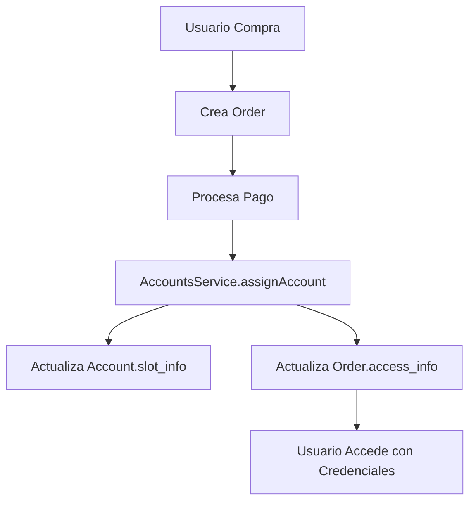

# 🔄 Migración UserOrder → Order

## 📋 Resumen de Cambios

Hemos fusionado los schemas `UserOrder` y `Order` para eliminar redundancia y simplificar la arquitectura.

### ✅ **Antes (Redundante):**
```
Order (transacciones) + UserOrder (accesos) = 2 schemas separados
```

### ✅ **Después (Simplificado):**
```
Order (completo) = 1 schema unificado
```

## 🗂️ Estructura del Nuevo Schema Order

```typescript
Order {
  // INFORMACIÓN BÁSICA
  customer: ObjectId,           // Cliente
  user_id: string,             // ID del usuario
  out_trade_no: string,        // Número único de orden
  
  // INFORMACIÓN DEL SERVICIO
  service_name: string,        // "Netflix", "Spotify"
  plan_name: string,          // "6 meses Personal"
  duration_months: number,    // Duración en meses
  max_users: number,          // Máximo de usuarios
  
  // ESTADOS Y FECHAS
  order_status: OrderStatus,  // 'pending' | 'active' | 'expired'
  starts_at: Date,           // Inicio del servicio
  expires_at: Date,          // Vencimiento
  
  // ACCESO (fusionado de UserOrder)
  access_info: {
    account_id: ObjectId,     // Cuenta asignada
    profile_name: string,     // Nombre del perfil
    slot_number: number,      // Número de slot
    access_credentials: {
      email: string,
      password: string,
      profile_pin?: string
    }
  },
  
  // INFORMACIÓN DE PAGO
  payment_info: {
    transaction_id: string,
    payment_method: string,
    paid_at: Date
  }
}
```

## 🚀 Pasos de Migración

### 1. **Ejecutar Script de Migración**

```bash
# Ir al directorio del backend
cd /Users/jesusalejandrorojasponce/Desktop/e-commerce\ -\ metele/nestjs-ecommerce-backend

# Ejecutar migración
node scripts/migrate-user-orders.js
```

### 2. **Verificar Migración**

El script:
- ✅ Convierte `UserOrder` → `Order`
- ✅ Mapea estados correctamente
- ✅ Preserva información de acceso
- ✅ Crea backup en `user_orders_backup`
- ✅ Mantiene integridad referencial

### 3. **Actualizar Servicios**

Los siguientes servicios ya están actualizados:

#### **AccountsService**
```typescript
// ANTES
assigned_to.push(assignAccountDto.order_id);

// DESPUÉS  
assigned_to.push(assignAccountDto.order_id);
+ order.access_info = { account_id, credentials, ... };
+ order.order_status = 'active';
```

#### **OrdersService**
```typescript
// NUEVOS MÉTODOS
assignAccessToOrder(orderNumber, accessInfo)
getActiveUserOrders(userId)
expireOverdueOrders()
```

## 🔗 Flujo de Asignación Actualizado



## 📊 Beneficios de la Fusión

### **1. Eliminación de Redundancia**
- ❌ Antes: 2 schemas con datos duplicados
- ✅ Después: 1 schema unificado

### **2. Mejor Consistencia**
- ❌ Antes: Riesgo de desincronización
- ✅ Después: Fuente única de verdad

### **3. Queries Simplificadas**
```typescript
// ANTES (2 consultas)
const order = await Order.findOne({ out_trade_no });
const userOrder = await UserOrder.findOne({ order_number });

// DESPUÉS (1 consulta)
const order = await Order.findOne({ out_trade_no });
// order.access_info ya incluye todo
```

### **4. Mantenimiento Reducido**
- ❌ Antes: Mantener 2 schemas
- ✅ Después: Mantener 1 schema

## 🔧 Cambios en APIs

### **Endpoints Afectados:**

#### `/api/accounts/:id/assign`
```typescript
// RESPUESTA ACTUALIZADA
{
  "data": {
    "account_id": "...",
    "order_id": "...",        // NUEVO
    "order_number": "...",    // NUEVO
    "email": "...",
    "password": "...",
    "expires_at": "..."
  }
}
```

#### `/api/orders/:id`
```typescript
// INCLUYE ACCESO
{
  "data": {
    "order_status": "active",
    "access_info": {          // NUEVO
      "account_id": "...",
      "profile_name": "...",
      "access_credentials": {
        "email": "...",
        "password": "..."
      }
    }
  }
}
```

## ⚠️ Consideraciones

### **1. Backup Automático**
- Los `UserOrder` originales se guardan en `user_orders_backup`
- NO se eliminan automáticamente (por seguridad)

### **2. Compatibilidad**
- Mantenemos campos legacy (`ostatus`, `type_id`, etc.)
- APIs existentes siguen funcionando

### **3. Índices**
```typescript
// ÍNDICES AGREGADOS
OrderSchema.index({ user_id: 1, order_status: 1 });
OrderSchema.index({ expires_at: 1, order_status: 1 });
OrderSchema.index({ 'access_info.account_id': 1 });
```

## 🧪 Testing

### **Verificar Funcionalidad:**

1. **Crear Orden**
   ```bash
   curl -X POST /api/orders
   ```

2. **Asignar Cuenta**
   ```bash
   curl -X POST /api/accounts/:id/assign
   ```

3. **Verificar Acceso**
   ```bash
   curl -X GET /api/orders/:id
   # Debe incluir access_info
   ```

## 🎯 Próximos Pasos

1. ✅ **Migración completada**
2. ⏳ **Testing en desarrollo**
3. ⏳ **Despliegue a producción**
4. ⏳ **Eliminar `user_orders_backup` (después de verificar)**

---

## 💡 **Resultado Final:**

**Un sistema más simple, consistente y mantenible con una sola fuente de verdad para órdenes y accesos.**
